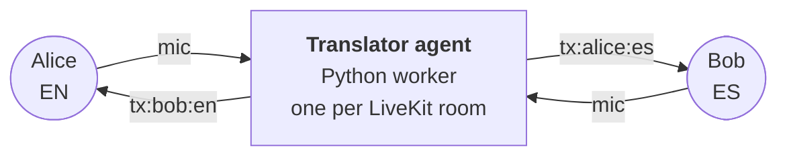

## How it works



Each participant's chosen language lives in their LiveKit `attributes.lang`. The agent watches `participantAttributesChanged` and reconciles a map of `(speaker, target_lang)` sessions — one Gemini Live session per pair, skipping pairs where source == target.

For each active pair the agent publishes two things into the room:

- an audio track named **`tx:<speaker>:<target_lang>`** carrying the translated speech
- a **`lk.translation`** text-stream carrying the matching captions, tagged with `target_lang`

The frontend subscribes to either the native mic or the matching `tx:*` track for each peer, based on the same `(listener_lang, speaker_lang)` predicate.

## Quick start

You need:
- Node.js 20+, [pnpm](https://pnpm.io/) (or run `corepack enable` and let the repo's `packageManager` field pin it)
- Python 3.11+, [uv](https://docs.astral.sh/uv/)
- A [LiveKit Cloud](https://cloud.livekit.io) project (free tier works)
- A [Gemini API key](https://aistudio.google.com/apikey)

```bash
# 1. Install deps and seed env files
pnpm run setup

# 2. Fill in credentials in .env.local and translator/.env.local
#    LIVEKIT_URL, LIVEKIT_API_KEY, LIVEKIT_API_SECRET (both files)
#    GEMINI_API_KEY (translator/.env.local only)

# 3. Run frontend + agent worker together
pnpm run dev
```

Open <http://localhost:3000>, click **Create session**, share the URL with another browser, pick different languages, unmute.

## Repo layout

```
gemini-live-translate-livekit/
├── src/                                # Next.js 16 frontend
│   ├── app/
│   │   ├── page.tsx                    # Landing
│   │   ├── api/token/route.ts          # Mints token + dispatches translator agent
│   │   └── session/[id]/
│   │       ├── page.tsx                # Pre-flight (name + language)
│   │       └── room/                   # In-call UI
│   │           ├── RoomClient.tsx
│   │           ├── InCall.tsx
│   │           ├── VideoGrid.tsx       + ParticipantTile, SelfView
│   │           ├── ControlBar.tsx      + LanguagePill
│   │           ├── CaptionsSidebar.tsx
│   │           └── useTranslationRouting.ts
│   └── lib/
│       ├── languages.ts                # 16 languages + "none" sentinel (Configurable)
│       └── config.ts                   # Caps, attribute keys
└── translator/                         # Python LiveKit Agents worker
    ├── src/
    │   ├── agent.py                    # @server.rtc_session(agent_name="gemini-translator")
    │   ├── router.py                   # TranslationRouter (reconcile loop)
    │   ├── session.py                  # GeminiSession (one per speaker→target pair)
    │   ├── audio.py                    # PCM glue
    │   └── config.py                   # Model id, debounce, grace, etc.
    ├── tests/test_router.py            # Demand-set computation
    ├── pyproject.toml
    ├── Dockerfile                      # For LiveKit Cloud Agents deploy
    └── livekit.toml
```

## Deploy

**Agent** — to LiveKit Cloud Agents:
```bash
cd translator
lk agent create --secrets-file .env.local .   # first time
lk agent deploy                               # subsequent deploys
```

**Frontend** — anywhere that runs Next.js. The repo includes a `Dockerfile` for container deploys (Cloud Run, Fly.io, Render, etc.). For Vercel, no special config needed since the only API route is `/api/token` and it's stateless.

Set on the frontend host:
- `LIVEKIT_URL`, `LIVEKIT_API_KEY`, `LIVEKIT_API_SECRET`

Set on the agent host:
- `LIVEKIT_URL`, `LIVEKIT_API_KEY`, `LIVEKIT_API_SECRET`, `GEMINI_API_KEY`

## Configuration

Caps in `src/lib/config.ts` and `translator/src/config.py` — adjust together:

| Setting | Default | Where |
|---|---|---|
| Max participants per room | 8 | `MAX_PARTICIPANTS` (token route) |
| Session TTL | 4h | token route `ttl` |
| Empty-room timeout | 60s | token route |
| Session grace on mute | 10s | `SESSION_GRACE_SEC` (agent) |
| Reconcile debounce | 250ms | `RECONCILE_DEBOUNCE_SEC` (agent) |
| Gemini model | `gemini-3.5-live-translate-preview` | `GEMINI_MODEL` (agent) |

## Tech stack

- **Frontend** — Next.js 16 (Turbopack), React 19, `@livekit/components-react`, `livekit-client`
- **Token mint** — `livekit-server-sdk` (`RoomAgentDispatch` + `RoomConfiguration`)
- **Agent runtime** — `livekit-agents` 1.5 with `AgentServer.rtc_session()`
- **Translation** — Gemini Live API (raw v1beta `BidiGenerateContent` WebSocket with `translationConfig`)
- **Audio I/O** — `livekit.rtc.AudioStream` (16 kHz mono in) + `AudioSource` (24 kHz mono out)
- **Typography** — Instrument Serif (display), DM Sans (body), DM Mono (status)
- **Package management** — `pnpm` + `uv`

## LiveKit Room Setting Changes

### 1. `RoomClient.tsx` — manual track subscription

`autoSubscribe` is turned off in `connectOptions`:

```tsx
<LiveKitRoom
  ...
  connectOptions={{ autoSubscribe: false }}
  ...
/>
```

By default, LiveKit auto-subscribes every participant to every published track. That doesn't work here because the translator agent publishes **multiple audio tracks per speaker** (one `tx:<speaker>:<target_lang>` track for each active target language). If auto-subscribe were left on, every client would pull down every translation track for every language pair, not just their own. Disabling it hands control over to `useTranslationRouting.ts`, which decides — per participant — which tracks are worth subscribing to.

### 2. `useTranslationRouting.ts` — `applyAgentSubscriptions`

This new function runs the actual subscription logic whenever the agent's published tracks or the room's language attributes change. It takes the agent participant, the local user's chosen language (`myLang`), a map of every peer's language (`peerLangs`), and the local user's own identity — then walks each of the agent's audio tracks and decides whether to subscribe.

For every agent-published audio track:

1. **Skip non-translation tracks.** `parseTranslationTrackName` tries to parse the track name as `tx:<speaker>:<target_lang>`. If it doesn't match that pattern (e.g. it's some other agent state/audio track), the function leaves it alone entirely — no subscribe/unsubscribe call.

2. **Rule 1 — Never hear your own translated voice.** If the track's source speaker is the local user themself, unsubscribe. You don't need a translation of what you just said.

3. **Rule 2 — "Native language" listeners get no translation tracks.** If the user has selected `NATIVE_LANG` (i.e., "listen to raw audio only, no translation"), unsubscribe from every agent track, full stop.

4. **Rule 3 — Only your target language.** The track's `target_lang` (parsed from the track name) must equal `myLang`. This filters out translation tracks meant for other listeners in the room.

5. **Rule 4 — Don't translate someone who already speaks your language.** Using `peerLangs`, look up the original speaker's language. If the speaker's language already matches `myLang`, there's no need for a translated version — you'd just be listening to a duplicate/derivative of audio you can already understand natively.

The final subscription decision is `matchesMe && speakerNotMyLang` — the track is only subscribed to if it's both addressed to your language **and** the speaker doesn't already speak that language.

**Net effect:** each client ends up subscribed to exactly one stream per peer — either that peer's raw mic (if same language) or their `tx:<peer>:<myLang>` translation track — instead of the default flood of every track the agent publishes.